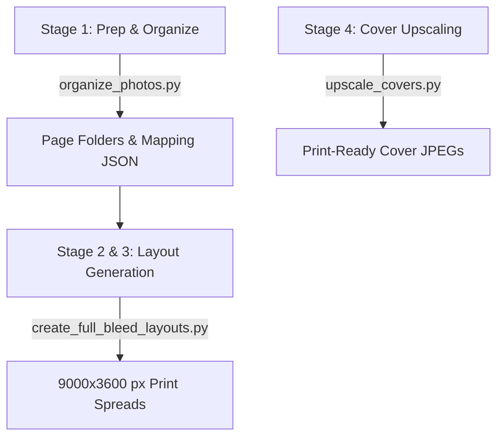

# Photo Book Builder

This skill provides a complete system for organizing, structuring, and generating print-ready, high-resolution photo books. It is designed for 12" × 30" open spreads (15" × 12" closed book size) at 300 DPI, enforcing strict gutter margins to prevent content from being lost in the binding.

## Core Capabilities

The photo book builder relies on four main stages:



---

## Stage-by-Stage Workflow

### Stage 1: Preparation & Balanced Page Sorting
Chronological sequence must be preserved at a macro level, but photos should be scrambled within local windows (chunks) to balance the number of landscape ("L") and portrait ("P") images per page folder.
*   **Target Pages**: 20 page folders (`page 1` to `page 20`).
*   **Balanced Distribution**: Target 11 or 12 photos per page (e.g. 9 Landscapes and 2-3 Portraits per page).
*   **JSON Map**: A mapping file `photo_organization_map.json` is generated to track which photos belong to which page.

**Execution**:
Run the organizer script, specifying the source folder containing the flat list of JPEG images and the target output directory:
```bash
python scripts/organize_photos.py --dir "path/to/photos" --out "path/to/workspace" --seed 42
```
*Note: If running on Windows, use `python -Xutf8` to avoid console encoding issues with status output.*

---

### Stage 2: Grid Layout & Coordinates
Spreads are generated at $9000 \times 3600$ px (300 DPI). Each page half gets an active grid area of $4275 \times 3300$ px after subtracting margins and gutter seams:
*   **Outer Margins**: 150 px top, bottom, and outside edges.
*   **Vertical Center Gutter**: 150 px total gutter seam (no image content between $x = 4425$ and $x = 4575$).
*   **Image Gaps**: 40 px spacing horizontally and vertically.

Layout configurations are determined dynamically based on photo counts and orientations:
*   **Template 5A (5 Photos: 4L, 1P)**: One large landscape col, one portrait + landscape col.
*   **Template 6A (6 Photos: 5L, 1P)**: Two landscape rows (4 total), one portrait + landscape col.
*   **Template 6B (6 Photos: 4L, 2P)**: Two large landscape rows (2 total), one double-portrait + double-landscape col.

For a complete coordinate reference and details on column configurations, see [layout_templates.md](references/layout_templates.md).

---

### Stage 3: Spread Assembly & Rendering
The layout compiler reads the page directories, detects photo orientations on the fly, applies the coordinate grids, crops photos to fill cells (using centered LANCZOS fit-scale), and merges them into $9000 \times 3600$ px JPEG spreads.
*   **Page Swapping**: Alternating layout orientation avoids monotonous designs. Left page columns swap if `page_num % 2 == 0`, and right page columns swap if `page_num % 3 == 0`.

**Execution**:
Compile the print-ready layouts:
```bash
python scripts/create_full_bleed_layouts.py --workspace-dir "path/to/workspace" --out-dir "path/to/output/layouts" --quality 95
```

---

### Stage 4: Cover Art Upscaling
AI-generated cover art and presentation box lid files need to be upscaled to final high-resolution print dimensions using high-quality LANCZOS interpolation.
*   **Front/Back Cover size**: $4500 \times 3600$ px.
*   **Presentation Briefcase Box size**: $4950 \times 4050$ px.

**Execution**:
Upscale cover background textures or complete cover designs:
```bash
python scripts/upscale_covers.py --src "path/to/cover.png" --out "path/to/upscaled_cover.jpg" --width 4500 --height 3600 --quality 95
```

---

## Revert Option
If you need to restart the process or undo the page folder classification, run the revert tool to move photos back to the root workspace directory and remove empty page folders:
```bash
python scripts/revert_organization.py --workspace-dir "path/to/workspace"
```

## Bundled Resources

*   **Scripts**:
    *   [organize_photos.py](file:///C:/Users/johno/.gemini/config/skills/photo-book-builder/scripts/organize_photos.py) - Groups and balances photo directories.
    *   [create_full_bleed_layouts.py](file:///C:/Users/johno/.gemini/config/skills/photo-book-builder/scripts/create_full_bleed_layouts.py) - Assembles masonry grid pages into print-ready spreads.
    *   [upscale_covers.py](file:///C:/Users/johno/.gemini/config/skills/photo-book-builder/scripts/upscale_covers.py) - General-purpose upscaling script.
    *   [revert_organization.py](file:///C:/Users/johno/.gemini/config/skills/photo-book-builder/scripts/revert_organization.py) - Restores files back to flat source directories.
*   **References**:
    *   [layout_templates.md](file:///C:/Users/johno/.gemini/config/skills/photo-book-builder/references/layout_templates.md) - Exact coordinates, dimensions, and grid cells.
