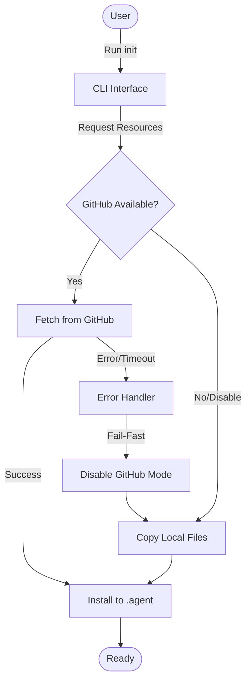

# CLI Resource Installer & Network Resilience

## Overview
The VibeSuite CLI (`src/cli.js`) serves as the primary entry point for initializing the VibeCode ecosystem. Its core function, the **Resource Installer**, handles the acquisition and deployment of "Brain Resources" (Workflows and Skills) into the user's workspace.

Recently enhanced with a **Smart Network Protocol**, the installer is designed to be resilient against poor connectivity, ensuring users can always access their tools even when GitHub's raw content servers are unstable or unreachable.

## Architecture

### Files
| File | Purpose |
|------|---------|
| `src/cli.js` | **Interactive UI**. Handles user prompts (using `prompts` library) and high-level orchestration of the install process. |
| `src/utils.js` | **Core Logic**. Contains the "Smart Network Protocol", GitHub fetchers, file system operations, and fallback mechanisms. |

### Dependencies
- `commander`: CLI command parsing.
- `prompts`: Interactive user selection.
- `fs-extra`: File system operations.
- `https` / `child_process`: Network requests (Node native + curl fallback).

## Key Components

### 1. The Resource Installer (`vibesuite init`)
The installer follows a "Scaffold & Fill" pattern:
1.  **Selection**: User selects components (Workflows, Skills, YAMLs, Legacy).
2.  **Targeting**: User specifies the destination directory.
3.  **Acquisition**: The CLI attempts to download fresh copies from the GitHub repository (`main` branch) to ensure the user has the latest version.
4.  **Deployment**: Files are written to `.agent/workflows` and `.agent/skills`.

### 2. Smart Network Protocol (SNP)
*Added in `src/utils.js` (Jan 2026)*

The SNP addresses the critical issue of "hanging" downloads during network instability. Previously, if GitHub's raw content servers reset connections (`ECONNRESET`), the CLI would retry indefinitely or wait 2 minutes per file, leading to perceived freezes.

**Protocol Rules:**
1.  **Fail-Fast**: If *any* critical network error occurs (Timeout, Connection Reset, Curl Error) during a download, the system **immediately** aborts the remaining network requests.
2.  **Circuit Breaker**: The `disableGitHub()` flag is set, preventing any further attempts to contact GitHub for the duration of the session.
3.  **Automatic Fallback**: The system instantly switches to the **Local Fallback Strategy**, copying files from the local package resources (`PATHS.workflows`, `PATHS.skills`) instead.
4.  **Aggressive Timeouts**:
    - `https` requests: **10 seconds** (down from 120s).
    - `curl` requests: **10 seconds**.

## Data Flow

## Configuration

The protocol behavior is hardcoded in `src/utils.js` for reliability:

| Constant | Value | Description |
|----------|-------|-------------|
| `FETCH_TIMEOUT` | `10000` (10s) | Max time for Node.js HTTPS requests. |
| `CURL_TIMEOUT` | `10` (10s) | Max time for fallback Curl requests. |
| `retries` | `3` | Attempts per file (only if errors are non-critical). |

## Changelog

### 2026-01-31: Smart Network Protocol Implementation
- **Change**: Implemented "Fail-Fast" logic in `downloadFromGitHub`.
- **Reason**: Users reported `ECONNRESET` loop when downloading workflows on unstable connections.
- **Change**: Added `disableGitHub()` circuit breaker.
- **Reason**: To prevent checking network status for every single file after a confirmed failure.
- **Change**: Reduced timeouts from 120s to 10s.
- **Reason**: To improve UX and responsiveness during failure states.
